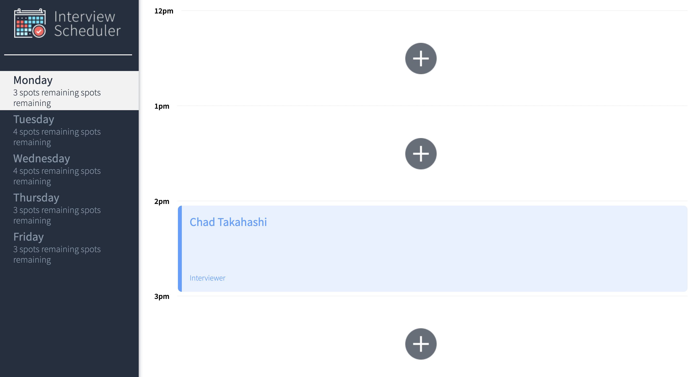
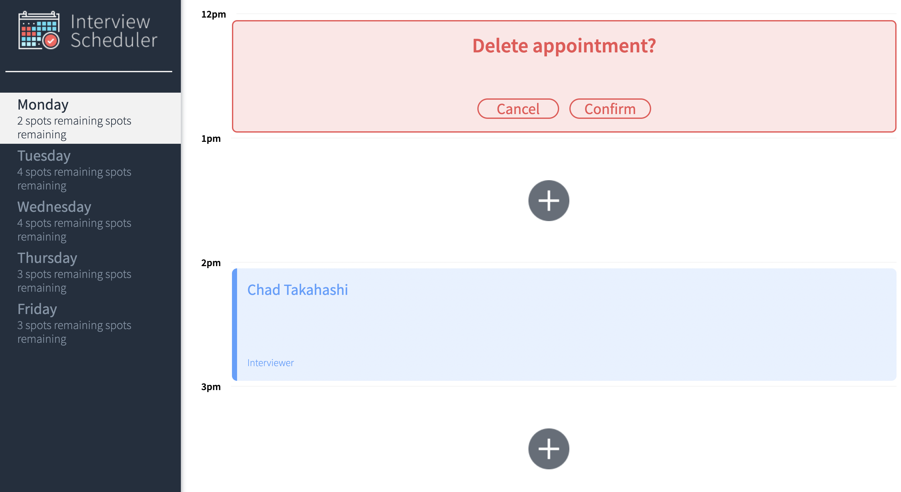

# Interview Scheduler

Interview Scheduler is a single page React app built using React. It allows users to book, edit, and cancel appointments.




## Setup

Install dependencies with `npm install`.

## Running Webpack Development Server

```sh
npm start
```

## Running Jest Test Framework

```sh
npm test
```

## Running Storybook Visual Testbed

```sh
npm run storybook
```
